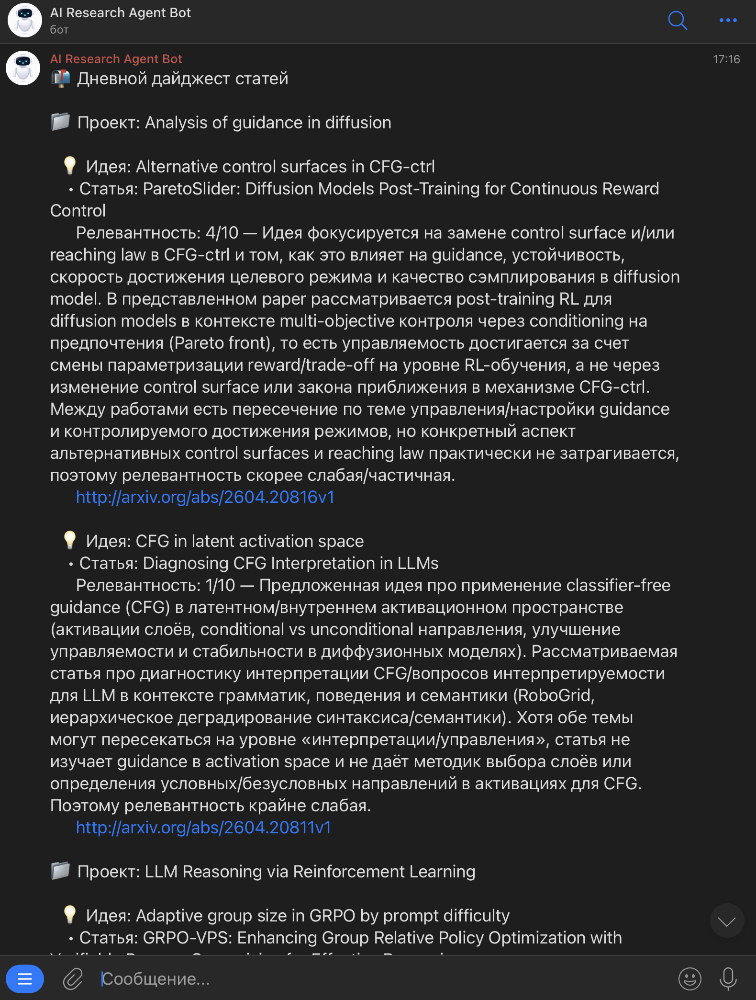

# AI Research Agent

Персональный AI-ассистент для исследователей (ассистент ориентирован, в основном, на ML): помогает вести каталог проектов и идей, каждое утро приносит в Telegram дайджест свежих arXiv-статей, отранжированных под активные идеи исследователя.

- **Бот**: [@research_agent_ai_bot](https://t.me/research_agent_ai_bot)
- **n8n (оркестрация воркфлоу)**: <https://n8n.ai-research-agent.com/>
- **Langfuse (трейсинг, промпты, эвалуаторы)**: <https://langfuse.ai-research-agent.com/>



---

## 1. Продуктовая гипотеза

Целевой пользователь — исследователь (индустриальный или академический), например, в ML, ежедневно мониторящий arXiv по нескольким категориям (cs.LG, cs.AI, cs.CL, cs.CV). Ручной процесс съедает 30–60 минут в день на чтение заголовков и abstract'ов, при этом периферийные темы выпадают из поля внимания, а уже встречавшиеся работы забываются. Альтернативы вида Semantic Scholar отстают по свежести на дни-недели, что критично: исследователю важно оставаться в максимальной осведомлённости, и при этом удобно искать среди уже виденных работ.

**AS IS → TO BE.** Вместо ручного скроллинга arXiv исследователь ведёт в Telegram-боте список проектов и идей. Каждое утро приходит дайджест на 3–5 наиболее релевантных свежих препринтов по каждой активной идее с LLM-обоснованием релевантности. Чтение дайджеста занимает около 5 минут в день; охват релевантной литературы — не ниже, чем при ручном трекинге, а за счёт накопления корпуса в локальной БД — выше. Дополнительно агент умеет искать по GitHub (через MCP-клиент), что важно при переходе от "читаю статьи" к "нахожу реализацию". Проекты и идеи хранятся не только как текст, но и как эмбеддинги, что уже сегодня используется в дайджесте (retrieval) и закладывает основу под будущие фичи — дедупликацию идей, обнаружение связей между проектами и так далее.

Экономия при 45 → 7 минутах в день и 22 рабочих днях в месяце — около **14 часов/месяц** на исследователя; при почасовой ставке junior ~1500 ₽ это ~21 000 ₽/мес, senior ~3000 ₽ — ~42 000 ₽/мес. Потенциальный эффект — средний для широкой аудитории и высокий для исследователей, для которых ежедневное слежение за литературой является частью должностной нагрузки.

→ Подробнее: [`docs/product.md`](docs/product.md).

## 2. Агентская система и интерфейс

Точка входа — Telegram-бот: пользователь пишет в чат, бот отвечает диалогом или дайджестом, slash-команды используются как быстрые шорткаты (`/ideas`, `/projects`, `/digest`, `/help`). За чатом стоит не один монолитный агент, а оркестрованный граф из **24 n8n-воркфлоу** — главный LangChain-агент (`telegram_agent`), вспомогательные CRUD-воркфлоу, cron-триггеры ingestion/embeddings/digest/alerts и MCP-сервер, экспонирующий часть возможностей наружу. Данные (users, projects, ideas, papers, embeddings, расписания, alert-дедуп) лежат в Postgres с pgvector.

→ Каталог воркфлоу с описаниями: [`n8n/workflows/README.md`](n8n/workflows/README.md).
→ Архитектура целиком: [`docs/architecture.md`](docs/architecture.md).

## 3. Инструменты агента

Главный LangChain-агент (`telegram_agent`) вызывает n8n-воркфлоу как tools; все tools — это вызовы через API (Postgres / OpenRouter / arXiv API / GitHub MCP). Нужный требованиями минимум (>3) закрыт с большим запасом:

**Поиск статей:**
- `arxiv_search` — on-demand-поиск по arXiv API, апсертит найденные работы в локальный корпус и ставит их в очередь на эмбеддинги.
- `semantic_search_papers` — RAG-поиск по корпусу через pgvector (HNSW-индекс по косинусу, эмбеддинги от `openai/text-embedding-3-small`).

**Проекты и идеи (+ эмбеддинги):**
- `add_project`, `add_idea` — INSERT в Postgres, **сразу считают эмбеддинг** от `title + description + keywords` / `title + description` и сохраняют его рядом с записью.
- `list_projects`, `list_ideas`, `update_project_status`, `update_idea_status` — CRUD-обёртки над таблицами `projects` / `ideas`.

**Расписание и дайджест:**
- `set_digest_schedule` / `get_digest_schedule` / `unset_digest_schedule` — UPSERT/SELECT/выключение пользовательского расписания (локальное время + TZ).
- `daily_digest_for_user` — on-demand и по cron собирает дайджест по идеям активных проектов. Внутри двухуровневый retrieval: (1) ретривим top-N свежих статей по косинусу к эмбеддингу идеи через `semantic_search_papers`, (2) прогоняем через LLM-реранкер `relevance_score`, сортируем по скору и оставляем top-3–5 с reasoning'ом.
- `digest_scheduler_tick` — минутный cron: находит due-пользователей по их TZ/времени и дёргает `daily_digest_for_user`.

**Внешние MCP-инструменты:**
- Главный агент ходит в **GitHub MCP** (поиск репозиториев, кода, issue) — это важно при переходе от "читаю статью" к "ищу реализацию".
- Одновременно у проекта есть **свой MCP-сервер** (`mcp_server` на n8n), который наружу отдаёт `semantic_search_papers` и `arxiv_search` — любой внешний MCP-клиент (Cursor, Claude Desktop и т.д.) может подключиться и пользоваться персональным корпусом исследователя как обычным tool'ом.

→ Подробнее (граф вызовов, схема БД, описание каждого воркфлоу): [`docs/architecture.md`](docs/architecture.md) + [`n8n/workflows/`](n8n/workflows/).

## 4. Логирование

- **Langfuse** — ключевой observability-слой: трейсы, модельные стоимости, latency, эвалуаторы, промпт-менеджмент. Трейсы в Langfuse попадают двумя путями:
  - из n8n — через self-hosted [**n8n-langfuse-shipper**](https://github.com/rwb-truelime/n8n-langfuse-shipper) (community-интеграция, упомянутая в [официальной странице интеграции Langfuse с n8n](https://langfuse.com/integrations/no-code/n8n)); shipper батчами читает `execution_data` из n8n Postgres и переливает в Langfuse по OTLP. Подробнее: [`shipper/README.md`](shipper/README.md);
  - напрямую из `bench/run_bench.py` — скрипт сам создаёт trace и generation через Langfuse Ingestion API, а shipper затем склеивает OTLP-спаны n8n-исполнения с тем же `trace_id` (через `LANGFUSE_TRACE_ID_FIELD_NAME`) в один консолидированный трейс. Подробнее: [`bench/README.md`](bench/README.md).
- **Промпты** (`relevance_score`, `telegram_agent_system`) тоже хранятся в Langfuse — воркфлоу тянут актуальную production-версию на каждом запуске. Source of truth для редактуры — [`prompts/`](prompts/), синк — [`scripts/prompts_sync.py`](scripts/prompts_sync.py).
- **Postgres** — состояние (users, projects, ideas, papers, paper_embeddings, расписания, chat memory для telegram-агента, `alert_buckets` для дедупа алертов).

→ Подробнее (диаграмма потоков трейсов): [`docs/architecture.md`](docs/architecture.md#observability).

## 5. Оценка

Для оценки качества используется **LLM-as-a-Judge** (далее — LAAJ): отдельная LLM с rubric-промптом ставит оценку за сгенерированные агентом ответы. Эвалуаторов два — один для оффлайн-экспериментов, второй для production-трейсов; оба написаны на основе одного rubric'а, отличаются только скоупом применения. В качестве модели-судьи выбран `anthropic/claude-sonnet-4.6` — достаточно сильная модель, чтобы оценка была корректной, но дешевле, чем topline-модели.


### 5.1. Оффлайн

Собран фиксированный датасет `relevance_score_bench` в Langfuse (20 пар идея↔статья, курированные). На нём прогнаны разные кандидатные модели в роли реранкера в `relevance_score` — это та точка пайплайна, где делается больше всего LLM-запросов и где качество особенно важно. Победитель по скору `relevance_score_judge_experiments` — **`google/gemini-3-flash-preview`**: он не только обгоняет конкурентов по мягкому судейскому скору, но и балансирует это разумной стоимостью. Для главного агента (`telegram_agent`) из соображений оптимальности цена/качество/латенси выбрана `openai/gpt-5.4-mini`.


→ Подробнее (методология, таблица результатов, как пере-прогнать): [`docs/evals.md`](docs/evals.md) → глубже: [`bench/README.md`](bench/README.md).

### 5.2. Онлайн

- В Langfuse работает второй LAAJ-эвалуатор, который скорит боевые (production) трейсы по релевантности и полезности ответа — выборка идёт с production-трейсов агента, что даёт непрерывную обратную связь о фактическом качестве.
- **Telegram-алерты** в отдельный админский чат:
  - `alerts_error_handler` — падения любых production-воркфлоу (глобальный Error Workflow n8n);
  - `alerts_cost_guard` — превышения часового и дневного бюджетов по стоимости LLM (читает Langfuse Metrics API, дедупает алерты через таблицу `alert_buckets` в Postgres).
- Langfuse-дашборды:


→ Подробнее: [`docs/evals.md#online`](docs/evals.md#online).

---

## Quick start

Поднять всё локально (Postgres+pgvector, n8n, Langfuse-стек, Caddy, shipper):

```bash
git clone <this-repo> && cd ai-research-agent
cp .env.example .env                                    # заполнить значения
docker compose up -d
scripts/db_apply_schema.sh                              # накатить postgres/schema.sql в БД app
# в UI n8n: Settings → Community Nodes → установить @langfuse/n8n-nodes-langfuse
scripts/n8n_import_workflows.sh                         # импортировать n8n/workflows/
python3 -m venv .venv                                   # PEP 668-safe venv для python-утилит
.venv/bin/pip install -r scripts/requirements.txt
.venv/bin/python scripts/prompts_sync.py push           # залить prompts/*.md в Langfuse
```

Дальше — создать n8n credentials и эвалуаторы в Langfuse по чеклистам в [`docs/deploy.md`](docs/deploy.md).

## Repo map

```
ai-research-agent/
├── README.md                    ← этот файл
├── docs/                        ← полные описания (по пунктам этого README)
│   ├── product.md
│   ├── architecture.md
│   ├── evals.md
│   └── deploy.md
├── n8n/
│   ├── workflows/               ← экспортированные воркфлоу n8n + md-описания
│   └── community-packages.txt   ← список обязательных community nodes
├── bench/                       ← оффлайн-бенчмарк relevance_score + датасет
├── shipper/                     ← Dockerfile для self-hosted n8n-langfuse-shipper
├── prompts/                     ← source of truth для Langfuse Prompt Management
├── scripts/                     ← shell/python утилиты (schema, import, prompts sync)
├── caddy/                       ← Caddyfile (HTTPS + reverse proxy)
├── postgres/
│   ├── init.sql                 ← создание БД app при первом старте
│   └── schema.sql               ← схема БД app (users, projects, ideas, papers, ...)
├── assets/                      ← скриншоты для документации
├── docker-compose.yml           ← весь стек
└── .env / .env.example
```
