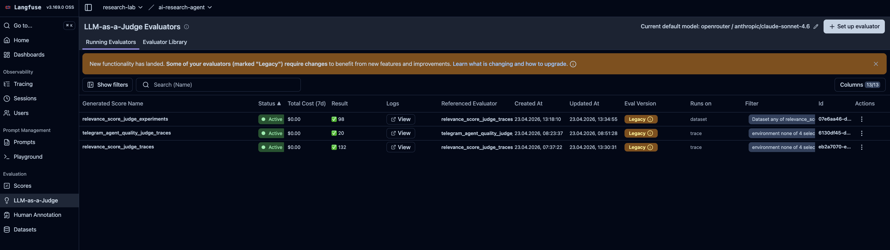
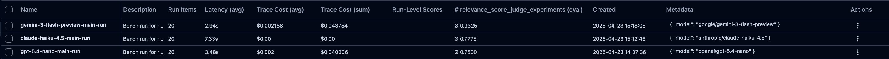
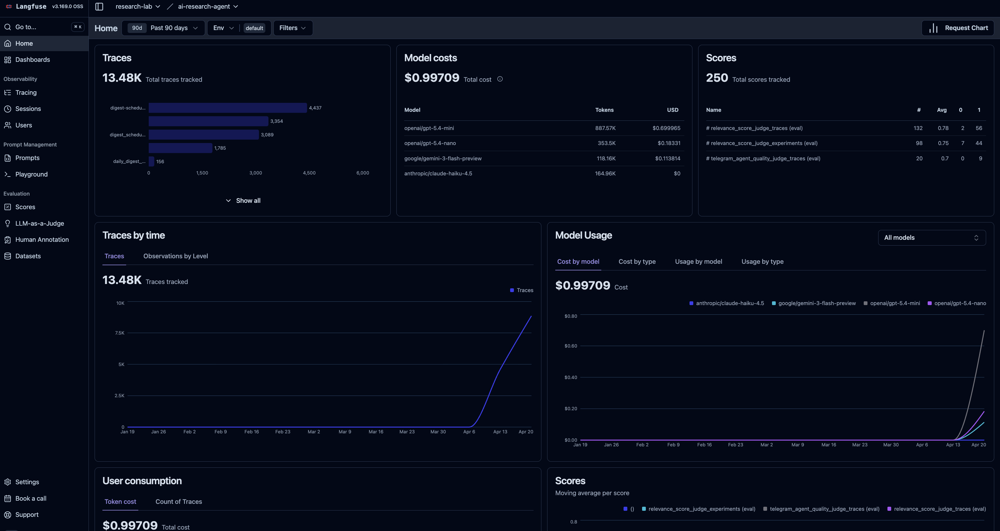
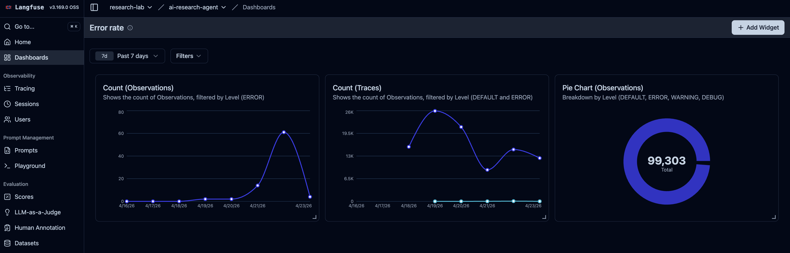
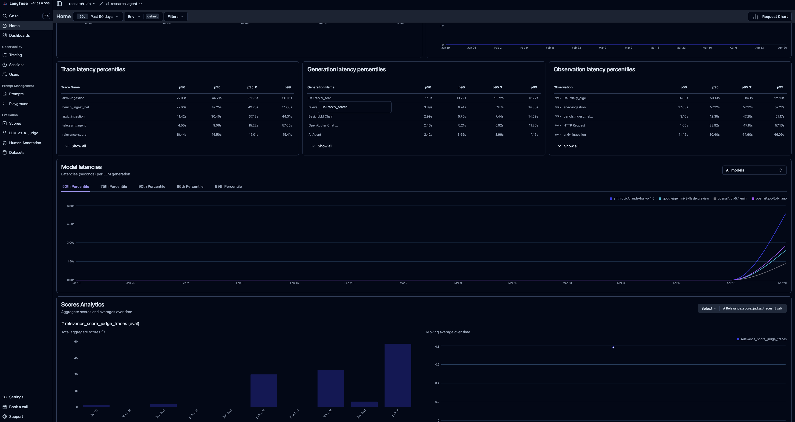

# Оценка качества

Документ раскрывает пункт 5 требований: оффлайн-бенчмарк и онлайн-мониторинг.

В основе оценки — **LLM-as-a-Judge** (далее LAAJ): отдельная, заведомо сильная LLM получает rubric-промпт с описанием критериев, читает input и output оцениваемого шага и ставит скор. Подход стандартный для систем, где нет ground-truth-разметки: для нашего случая (релевантность свежего arXiv-препринта исследовательской идее) ручная разметка тоже в принципе возможна, но не масштабируется — поэтому LAAJ выигрывает и по стоимости, и по скорости итераций.

В Langfuse настроены **два** эвалуатора на одном rubric'е — разный scope применения:

- `relevance_score_judge_experiments` — прогоняется на dataset-run'ах (оффлайн-эксперименты).
- `relevance_score_judge_traces` — прогоняется на боевых production-трейсах (онлайн-мониторинг).

В качестве модели-судьи выбран `anthropic/claude-sonnet-4.6`: достаточно мощная, чтобы адекватно судить рассуждения реранкера, но ощутимо дешевле topline-моделей (opus/sonnet-thinking). Замены модели-судьи на более слабую (nano/haiku) делали скоры шумными на глаз — при желании это можно замерить отдельным мета-бенчмарком, но не в рамках текущей итерации.



## <a id="offline"></a>5.1. Оффлайн

### Методология

- **Датасет.** `relevance_score_bench` в Langfuse — 20 курированных пар `(idea, paper)`, собранных из реальных исследовательских идей автора и свежих arXiv-препринтов по этим темам. На каждую из 4 идей — по 5 статей, ранжированных от явно релевантных до явно периферийных; такая градация даёт судье возможность различать кандидатов, а не ставить всем 10 или всем 3. Сборка датасета: см. [`bench/create_dataset.py`](../bench/create_dataset.py), исходные пары в [`bench/final_20_pairs.json`](../bench/final_20_pairs.json).
- **Что именно бенчмаркается.** Модель в роли LLM-реранкера внутри воркфлоу `relevance_score`. Это сознательный выбор фокуса: реранкер — hot-path в дайджесте (N идей × K кандидатов на идею × ежедневно × на каждого пользователя), поэтому именно там качество и стоимость LLM критичнее всего.
- **Скрипт.** [`bench/run_bench.py`](../bench/run_bench.py) — per-model прогон. Для каждой пары датасета:
  1. создаёт преflight-трейс в Langfuse напрямую через Ingestion API (с `tags=['bench', ...]` + метадатой датасета);
  2. дёргает n8n-webhook `bench_relevance_wrapper` с `trace_id`, `model`, `idea_id`, `paper_id`;
  3. `relevance_score` внутри n8n отрабатывает нормально, `n8n-langfuse-shipper` приклеивает OTLP-спаны к тому же `trace_id`;
  4. результат воркфлоу записывается в trace.output, а trace линкуется к dataset-run'у;
  5. `relevance_score_judge_experiments` автоматически скорит каждый новый dataset-run-item.
- **Метрика.** Скор LAAJ в [0..1] (нормализованная версия 0..10-скора судьи). Также доступны latency/cost — но при выборе модели-реранкера основной критерий всё же качество: дайджест отправляется раз в сутки, поэтому пара лишних секунд латентности некритичны.

### Результаты и выбор модели

Сравнение моделей в Langfuse → Datasets → `relevance_score_bench` → Compare runs:



По колонке `relevance_score_judge_experiments (eval)` лидер — **`google/gemini-3-flash-preview`** (именно flash-preview, не nano). Он одновременно:

- даёт заметно более высокий средний скор, чем более дешёвые кандидаты (nano-модели) — судья стабильно видит у него лучше выстроенные reasoning'и и точнее выбранные `key_concepts_matched`;
- остаётся в рамках разумной стоимости — дешевле full-size моделей, которые шли почти вровень или с минимальным преимуществом, но в 3-5 раз дороже.

Поэтому для реранкера выбран `gemini-3-flash-preview`. Для главного агента (`telegram_agent`) из тех же соображений — "хватает, чтобы корректно дергать tools + писать связные ответы на русском, при минимальной стоимости" — оставлена `openai/gpt-5.4-mini` без отдельного бенча: там нагрузка и цена запроса на порядок ниже, делать отдельный эксперимент нецелесообразно.

### Воспроизвести

Пошагово — [`bench/README.md`](../bench/README.md). Вкратце:

```bash
python3 bench/create_dataset.py                     # один раз
python3 bench/run_bench.py --model <openrouter/id>  # один run на модель
```

## <a id="online"></a>5.2. Онлайн

Цель — непрерывно понимать, не деградировало ли качество на бою, и быстро ловить отказы / аномальный расход.

### Онлайн-LAAJ

`relevance_score_judge_traces` применяется к production-трейсам — прежде всего тем, что рождаются в `daily_digest_for_user` → `relevance_score`. Скор пишется на trace-level и доступен в дашбордах Langfuse. Это даёт две вещи:

- **Обнаружение регрессий промпта.** Если после правки `relevance_score` средний LAAJ-скор на проде просел — видно на дашборде через сутки-двое, без отдельного прогоняния оффлайн-бенча.
- **Сигнал "дрейфа входа".** Если пользователи начинают заводить идеи вне области, где реранкер обучен / настроен (например, не ML, а биоинформатика), распределение скоров сместится и это будет видно до того, как пользователи отвалятся.

### Алерты в Telegram

Отдельный админский чат получает:

- **Падения воркфлоу** от `alerts_error_handler` — глобальный Error Workflow n8n; алерт содержит имя воркфлоу, ноду, error message, timestamp. Настройка — в Workflow Settings → Error Workflow для каждого production-воркфлоу.
- **Превышение бюджета** от `alerts_cost_guard` — раз в 15 минут читает Langfuse Metrics API, сравнивает стоимость за последний час и сутки с порогами, алертит. Идемпотентность — таблица `alert_buckets` (один алерт на бакет, независимо от того, сколько раз cron засёк).

### Дашборды Langfuse

**Trace count + cost** — общее число трасс в сутки, стоимость в $, разбивка по моделям:



**Error rate** — доля error-трасс и распределение по типам ошибок:



**LAAJ-скоры и штрафы** — распределение онлайн-скора `relevance_score_judge_traces` + штрафные метрики (timeout, пустой output, неудачный structured-output parse):



### Что покрыто, а что нет

Покрыто: стабильность (error rate), бюджет (cost guard), качество ответов (онлайн-LAAJ), latency (в trace-дашборде).

Логичные следующие шаги после MVP: в текущей итерации не покрыты retention пользователей, open-rate дайджестов в Telegram, явный user feedback (👍/👎 на карточки в дайджесте). Поэтому можно было бы добавить inline-кнопки в дайджест и писать фидбэк обратно в `idea_paper_matches`; собранный сигнал использовать как ground-truth для калибровки LAAJ и/или как feature для ранкера.
